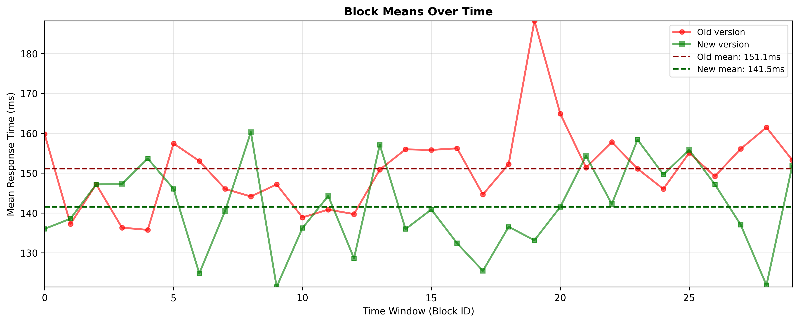

# Are You Sure the New Web Service Is Faster?
_Why comparing average response times in load tests is not such a good idea._


"The new version responds on average 6 milliseconds faster. Deploy to production!"

How many times have we made similar decisions based simply on comparing averages in load tests? The problem is that this approach hides two fundamental pitfalls: the **role of chance** and the **effect of sampling**.

Imagine flipping a coin 20 times and getting 13 heads. Is the coin biased? Or were you just lucky? The same applies to performance tests: if your new service version shows lower response times, how much of this improvement is real and how much is just random variability?

Chance is not the only problem. The **way** you collect data heavily influences the results. Making 1000 consecutive calls to the service in 10 seconds does not produce independent observations: the shared system state (cache, connection pools, garbage collection) creates artificial correlations. A slow call tends to be followed by other slow calls, not because the service is inherently slower, but due to temporary congestion effects.

These problems are not just academic technicalities. They lead to wrong decisions: promoting non-existent "improvements" to production or, worse, discarding real optimizations because the tests did not highlight them with sufficient clarity.

In this article we will explore how to apply appropriate statistical tests, starting from the classic t-test to more robust approaches like Welch's test and the permutation test. We will also see practical strategies to improve sampling and reduce spurious correlations in the data.

**All code examples and data used are available in the GitHub repository:** [github.com/nicolinux72/statistical-tests.git](https://github.com/nicolinux72/statistical-tests.git)


## Statistical Tests (Very Briefly)
A statistical test serves to verify a hypothesis (called the null hypothesis) against collected evidence. For example, if we were to flip a coin, the null hypothesis could be to consider it balanced (50% heads, 50% tails). The test tells us how likely it is to obtain the observed results if this hypothesis were true, that is, it aims to reject the null hypothesis when this probability is very low.


 
For a balanced coin, 20 flips follow a binomial distribution, Bin(20;0.5), represented in the graph. The most likely value is 10 heads (17.6%), while extreme outcomes like 0 or 20 heads have almost zero probability (0.0001%).

The reasoning is this: having actually obtained 13 heads out of 20 flips, we calculate the theoretical probability of obtaining those 13 or more heads assuming the null hypothesis is true. In our case it is 13.16%, so not particularly unlikely.

To decide when to reject the null hypothesis, we set a __significance level__ α (typically 5%). If the probability p of the observed evidence is less than α, we reject the null hypothesis. In our example, with α=5%, we would reject the hypothesis of a balanced coin only with 15 or more heads (probability 2.07%).

## T-test
Returning to our web service, we need to perform a test whose null hypothesis is that the average response of the production version is slower than the new one, and discover if we can refute this hypothesis.

To proceed as in the previous parameter, we need to know the distribution of the statistic used by the test, in this case the difference between the means of the two service versions. Under some hypotheses we will discuss shortly, the distribution we need is the famous Student's t (formally the ratio between a normal distribution and the square root of a chi-square distribution, both normalized).


```python
from scipy.stats import ttest_ind

# df_old and df_new are pandas DataFrames with 'response_time' column
t_stat, p_value = ttest_ind(df_old['response_time'], df_new['response_time'])
print(f"p-value: {p_value:.4f} - {'Significant difference' if p_value < 0.05 else 'No difference'}")
```


The left graph shows the distributions of response times for the two versions, while the right one visualizes the Student's t distribution and compares the observed t-statistic, indicated by the red dashed line, with the orange dashed lines that delimit the __rejection regions__ for α=0.05. In this case, the observed statistic does not fall in the red shaded areas, so we have no grounds to reject the null hypothesis: the new service is not significantly faster.

<em>
Deep dive: The t-statistic is calculated as:

t = (μ₁ - μ₂) / SE = (146.68 - 140.62) / 3.81 ≈ 1.64

where μ₁ and μ₂ are the means of the two samples (146.68ms and 140.62ms respectively) and SE (Standard Error) is the standard error of the difference, which quantifies the uncertainty in estimating the difference between the means, taking into account the variability of the data and the sample size. In our example SE=3.81ms, and we therefore obtain t≈1.64.
</em>

## Necessary Conditions for a T-test
Let's return to the assumptions that allow us to use the t-test:
* __Independence__ the samples must be independent of each other, just as the observations _within_ individual samples must be independent of each other.
* __Normality__ the probability distributions must be normal, the famous bell-shaped Gaussian distribution.
* __Homoscedasticity__ the two populations must have the same variance.

Let's go into detail.

### Independence
The response times of a web service are rarely independent observations: the system state (pods, cache, network, ...) is shared between successive calls, creating correlation. Moreover, making N consecutive calls in a short interval, therefore the most common sampling method, introduces artificial autocorrelation: a slow call is more likely to be followed by another equally slow one.

To limit dependencies related to system state, requests should be made under comparable conditions regarding system load, pod startup, cache, and failover. Also isolate the pods or VMs involved in sampling or, if not possible, balance requests across different backends in a completely random manner.

Regarding correlations induced by the sampling method, instead of using the entire sequence of calls made in a continuous time interval, you could use one request every k or select them randomly (subsampling). Alternatively or in addition, make several calls in different time windows, calculate aggregated values in these windows, considering them as sampling units.



### Normality
Web service response times rarely follow a normal distribution: they typically have heavier right tails due to outliers with very long times. Fortunately, the central limit theorem comes to our aid.

The theorem guarantees that sample means tend to be normally distributed regardless of the original distribution of the data, provided the sample is sufficiently large. In practice, even if individual response times are not normal, as long as each sample contains at least 30 observations, their mean will be approximately normally distributed. This makes the use of the t-test valid even starting from non-normal distributions.

If you want to verify the normality of sample means, you can use a Q-Q plot or the Shapiro-Wilk test, but with samples of adequate size, the central limit theorem is generally sufficient to justify the use of the t-test.

### Homoscedasticity
Homoscedasticity, that is, the equality of variances between the two samples, is often problematic in comparisons between web services. Different versions of a service can have different variances, violating this assumption of the standard t-test. To solve the problem, we resort to Welch's test, a variant of the t-test that does not assume equal variances and which we will describe in the next paragraph.

## Welch's Test
Welch's test is a variant of Student's t-test that relaxes the homoscedasticity assumption, allowing the two samples to have different variances. This makes it particularly suitable for comparing web services, where the variances of response times can differ significantly between different versions or configurations.

Unlike the standard t-test, Welch's test calculates the degrees of freedom using the Welch-Satterthwaite approximation, which takes into account the variances and sizes of the samples. The test still requires that the samples be independent and that the sample means be approximately normal, a condition guaranteed by the central limit theorem with sufficiently large samples (n ≥ 30).

In Python, Welch's test is easily implemented using scipy by specifying the `equal_var=False` parameter:

```python
# df_old and df_new are pandas DataFrames with 'response_time' column
t_stat, p_value = ttest_ind(df_old['response_time'], df_new['response_time'], equal_var=False)
print(f"p-value: {p_value:.4f} - {'New version significantly faster' if p_value < 0.05 else 'No significant difference'}")
```


This approach is generally preferable to the standard t-test in real contexts, as it is more robust and does not significantly penalize the power of the test when the variances are actually equal.

## Permutation Test
As we have seen, obtaining perfectly independent samples is not simple in distributed systems, and in some cases even the normality assumption can be problematic despite the central limit theorem. The permutation test offers an interesting alternative because it requires a weaker assumption: exchangeability instead of independence.

Exchangeability means that the order of observations does not contain relevant information: if the null hypothesis were true (no difference between the two services), randomly permuting the "old" and "new" labels between observations should not change the distribution of the data. The test works by calculating the statistic of interest (for example, the difference of means) on the original data, then repeating the calculation on many random permutations of the labels. The p-value is the fraction of permutations that produce a statistic more extreme than the one observed.

To obtain exchangeability in web services, instead of sampling individual requests, we sample in blocks: for example, we collect response times in 5-minute time windows and consider the average of each window as a sampling unit. This way, the internal correlations within each block do not violate the exchangeability assumption between blocks.

```python
# Means calculated over time windows (blocks)
old_blocks = df_old.groupby('window_id')['response_time'].mean().values
new_blocks = df_new.groupby('window_id')['response_time'].mean().values

def statistic(x, y):
    return np.mean(x) - np.mean(y)

result = permutation_test((old_blocks, new_blocks), statistic, 
                         permutation_type='independent', n_resamples=10000)
```


The permutation test is particularly robust because it makes no assumptions about the shape of the distribution and works well even with small samples, making it a reliable choice when the conditions for the t-test are questionable.

## Bonus: Bootstrap
The bootstrap technique can be useful for estimating statistical properties of the response times of a single service, such as the mean or variance, and quantifying the uncertainty of these estimates. Unlike the previous tests, bootstrap is not used to compare two services but to understand how much we can trust our measurements on a single system.

Bootstrap works by resampling with replacement from the original sample: if we have collected n observations, we generate thousands of new samples by randomly drawing n values from the original sample (with the possibility of repetitions). For each of these "bootstrap" samples we calculate the statistic of interest, thus obtaining an empirical distribution of that statistic. This distribution allows us to calculate the confidence interval, that is, a range of values within which we expect the true population value to fall with a certain probability (typically 95%).

```python
# Observed response times (in milliseconds)
response_times = df['response_time'].values
n_bootstrap = 10000

# Generate bootstrap samples and calculate means
bootstrap_means = []
for _ in range(n_bootstrap):
    sample = np.random.choice(response_times, size=len(response_times), replace=True)
    bootstrap_means.append(np.mean(sample))

bootstrap_means = np.array(bootstrap_means)

# Calculate 95% confidence interval
ci_lower = np.percentile(bootstrap_means, 2.5)
ci_upper = np.percentile(bootstrap_means, 97.5)
observed_mean = np.mean(response_times)
```


The graph shows how the means calculated on bootstrap samples are distributed. The 95% confidence interval tells us that if we repeated the sampling infinitely many times, in 95% of cases the true population mean would fall within that interval. This gives us a quantitative measure of the uncertainty in our estimates, valuable information when making data-driven decisions.

## Conclusions
In many companies, load test results are used directly to compare performance between different versions of a service, based simply on the difference in observed means. However, this approach has significant limitations: not only does it ignore the role of chance in the results, but it is often based on sampling that violates the independence assumptions necessary for correct statistical analysis.

We have shown how to apply a more rigorous approach using appropriate statistical tests. Welch's test represents a solid choice when reasonably independent samples can be obtained through careful sampling strategies, while the permutation test offers greater robustness when independence is difficult to guarantee. Both approaches allow quantifying the probability that an observed difference is due to chance rather than a real performance difference.

The provided code examples can be easily adapted to your specific contexts, allowing you to transform raw load test data into statistically sound evidence. Ultimately, paying attention to sampling design and statistical analysis of results is not just an academic exercise: it is what distinguishes a decision based on impressions from a data-driven decision.

__Author's note:__ I wrote this article with the assistance of LLMs, particularly Claude, ChatGPT and Gemini CLI. Like everyone else, I've been doing vibe coding for a while but had not yet ventured as far as writing a popular science article. It was fun :-)

## Bibliography

### Classic Texts

**Fisher, R. A.** (1935). *The Design of Experiments*. Oliver and Boyd, Edinburgh. The foundational work that introduced the concepts of randomization and significance testing, laying the foundations of modern inferential statistics.

**Student** (Gosset, W. S.) (1908). "The probable error of a mean". *Biometrika*, 6(1), 1-25. The original article that introduces the t-distribution, still essential today for statistical analysis with limited sample sizes.

**Tukey, J. W.** (1977). *Exploratory Data Analysis*. Addison-Wesley. Seminal work that revolutionized the approach to data analysis, emphasizing the importance of visualization and exploration before formal inference.

**Welch, B. L.** (1947). "The generalization of 'Student's' problem when several different population variances are involved". *Biometrika*, 34(1-2), 28-35. The article that introduces Welch's test and the Welch-Satterthwaite approximation for degrees of freedom.

**Efron, B.** (1979). "Bootstrap methods: Another look at the jackknife". *The Annals of Statistics*, 7(1), 1-26. The foundational article on bootstrap, a technique that has transformed statistical analysis by allowing the estimation of sampling distributions without parametric assumptions.

### Modern Texts

**Good, P. I.** (2005). *Permutation, Parametric and Bootstrap Tests of Hypotheses* (3rd ed.). Springer. Comprehensive and accessible treatment of permutation tests and bootstrap, with particular attention to practical applications.

**Davison, A. C., & Hinkley, D. V.** (1997). *Bootstrap Methods and Their Application*. Cambridge University Press. Authoritative reference for the application of bootstrap in real contexts, with in-depth examples and case studies.

**Wasserstein, R. L., & Lazar, N. A.** (2016). "The ASA statement on p-values: Context, process, and purpose". *The American Statistician*, 70(2), 129-133. Important statement by the American Statistical Association on the correct use and limitations of p-values, fundamental for correctly interpreting statistical tests.

**VanderPlas, J.** (2016). *Python Data Science Handbook*. O'Reilly Media. Practical guide to data analysis in Python, with coverage of scipy.stats and resampling techniques. Available for free at https://jakevdp.github.io/PythonDataScienceHandbook/

### Web Resources

**SciPy Documentation - Statistical functions** (scipy.stats)  
https://docs.scipy.org/doc/scipy/reference/stats.html  
Complete official documentation of SciPy statistical functions, including ttest_ind, permutation_test and bootstrap.

**Towards Data Science** - "Understanding the t-test"  
https://towardsdatascience.com/  
Platform with numerous popular articles on statistical tests and their practical applications in data science.

**Real Python** - "Statistics in Python"  
https://realpython.com/python-statistics/  
Practical tutorials on applying statistics in Python, with reproducible code examples.

**CrossValidated** (StackExchange)  
https://stats.stackexchange.com/  
Active community of statisticians where you can find in-depth discussions on statistical tests, assumptions, and interpretation of results.

**Performance Testing Guidance** - Microsoft Azure  
https://learn.microsoft.com/en-us/azure/architecture/  
Microsoft guidelines on designing and interpreting performance tests for cloud applications.
