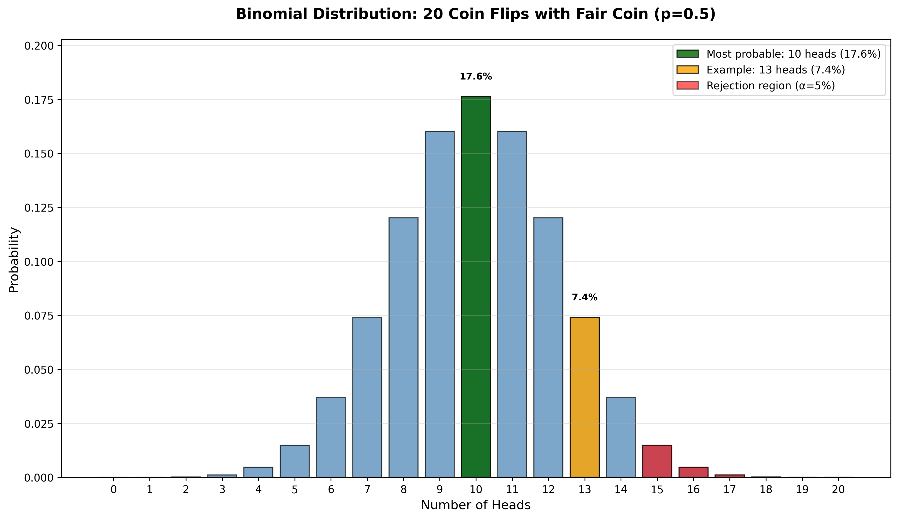
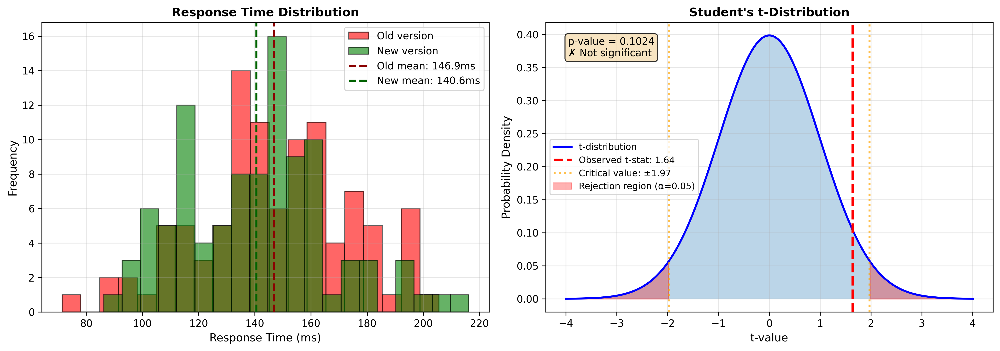
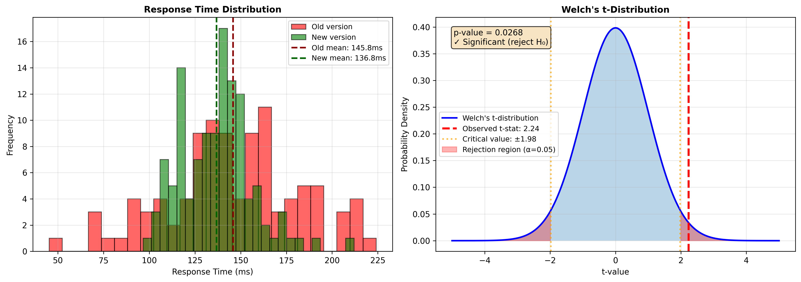
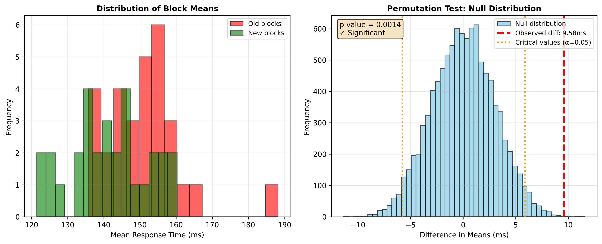
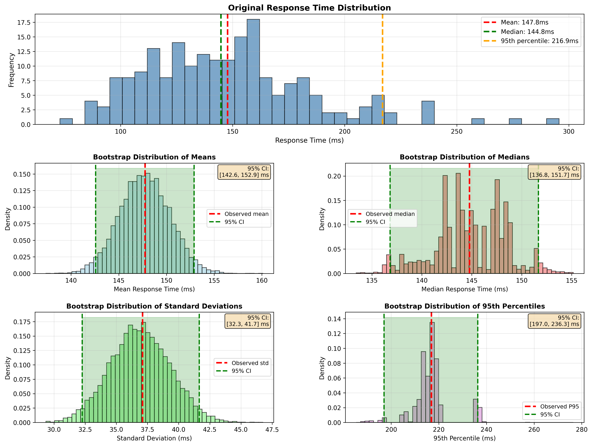

# Certi che il nuovo servizio web sia più veloce?
_Perché confrontare i tempi medi delle risposte ottenute nei test di carico non è una buona idea._


Quando si testa per il carico una nuova versione di un servizio web, spesso si confrontano i tempi medi di risposta con quelli della versione precedente. Tuttavia, basarsi solo sulle medie può essere fuorviante, perché non considera il ruolo del caso nei risultati.

Ad esempio, se ripetiamo i test e raccogliamo nuovi campioni di dati, otterremo medie diverse ogni volta. Questo significa che la differenza osservata tra i due servizi potrebbe dipendere sia dalla reale velocità, sia dalla semplice fortuna nel campionamento.

Per esprimere un giudizio razionale serve un minimo di statistica.


## I test statistici (molto molto brevemente)
Un test statistico serve a verificare un'ipotesi (detta ipotesi nulla) contro l'evidenza raccolta. Ad esempio, se lanciassimo una moneta, l'ipotesi nulla potrebbe essere ritenerla bilanciata (50% testa, 50% croce). Il test ci dice quanto sia probabile ottenere i risultati osservati se questa ipotesi fosse vera, ovvero si propone di smentire l'ipotesi nulla quando questa probabilità sia molto bassa.


 
In una moneta equilibrata, 20 lanci seguono una distribuzione binomiale, Bin(20;0,5), rappresentata nel grafico. Il valore più probabile è 10 teste (17,6%), mentre esiti estremi come 0 o 20 teste hanno probabilità quasi nulla (0,0001%).

Il ragionamento è questo: avendo realmente ottenuto 13 teste su 20 lanci, calcoliamo la probabilità teorica di ottenere quelle 13 o più teste assumendo vera l'ipotesi nulla. Nel nostro caso è 13,16%, quindi non particolarmente improbabile.

Per decidere quando rifiutare l'ipotesi nulla, si fissa una __soglia di significatività__ α (tipicamente 5%). Se la probabilità p dell'evidenza  osservata è minore di α, si rifiuta l'ipotesi nulla. Nel nostro esempio, fissato α=5%, rifiuteremmo l'ipotesi di moneta bilanciata solo con 15 o più teste (probabilità 2,07%).

## T-test
Tornando al nostro servizio web, dobbiamo realizzare un test la cui ipotesi nulla sia che la risposta media della versione in produzione sia più lenta della nuova e scoprire se riusciamo a confutare questa ipotesi. 

Per procedere come nel parametro precedente, ci occorre sapere la distribuzione della statistica utilizzata dal test, in questo caso la differenza tra le medie delle due versioni del servizio. Sotto alcune ipotesi che discuteremo tra poco, la distribuzione che ci occorre è la famosa t di Student (formalmente il rapporto tra una normale e la radice di una chi-quadrato entrambe normalizzate).


```python
from scipy.stats import ttest_ind

# df_old e df_new sono DataFrame pandas con colonna 'response_time'
t_stat, p_value = ttest_ind(df_old['response_time'], df_new['response_time'])
print(f"p-value: {p_value:.4f} - {'Differenza significativa' if p_value < 0.05 else 'Nessuna differenza'}")
```


Il grafico di sinistra mostra le distribuzioni dei tempi di risposta delle due versioni, mentre quello di destra visualizza la distribuzione t di Student e confronta la statistica t osservata, indicata dalla linea rossa tratteggiata, con le linee arancioni tratteggiate che delimitano le __regioni di rifiuto__ per α=0.05. In questo caso, la statistica osservata non cade nelle zone ombreggiate in rosso quindi non abbiamo elementi per rifiutare l'ipotesi nulla: il nuovo servizio non è significativamente più veloce.

<em>
Approfondimento: La statistica t si calcola come:

t = (μ₁ - μ₂) / SE = (146,68 - 140,62) / 3,81 ≈ 1.64

dove μ₁ e μ₂ sono le medie dei due campioni (rispettivamente 146,68ms e 140,62ms) e SE (Standard Error) è l'errore standard della differenza, che quantifica l'incertezza nella stima della differenza tra le medie tenendo conto della variabilità dei dati e della dimensione dei campioni. Nel nostro esempio SE=3.81ms, e otteniamo quindi t≈1,64.
</em>

## Condizioni di necessarie di un t-test
Torniamo alle ipotesi che ci consentono di usare il t test:
* __Indipendenza__ i campioni devono essere indipendenti tra loro così come devono essere indipendenti tra loro le osservazioni _dentro_ i singoli campioni.
*	__Normalità__ le distribuzioni di probabilità devono essere normali, la famosa distribuzione di Gauss a forma di campana.
*	__Omoschedasticità__ le due popolazioni devono avere la stessa varianza.

Scendiamo nel dettaglio:

### Indipendenza
I tempi di risposta di un servizio web raramente sono osservazioni indipendenti: lo stato del sistema (pod, cache, rete, …) è condiviso tra chiamate successive, creando correlazione. Inoltre, effettuare N chiamate consecutive in un breve intervallo, dunque la modalità più comune di campionamento, introduce autocorrelazione artificiale: a una chiamata lenta è più probabile che ne segua un'altra altrettanto lenta.

Per arginare le dipendenze legate allo stato del sistema si dovrebbe effettuare le richieste in condizioni comparabili per quanto riguarda carico del sistema, startup dei pod o cache e failover.  Anche isolare i pod o le VM coinvolte nel campionamento o, non potendo, bilanciare le richieste su diversi back-end in modo assolutamente casuale.

Riguardo alle correlazioni indotte della modalità di campionamento, invece di utilizzare l'intera sequenza di chiamate effettuata in un intervallo continuo di tempo, si potrebbe utilizza una richiesta ogni k oppure selezionarle in modo casuale (subsampling). Alternativamente o in aggiunta, si effettuano diverse chiamate in finestre temporali diversi, si calcolano valori aggregati in queste finestre considerandole come unità campionarie.

### Normalità
I tempi di risposta dei servizi web raramente seguono una distribuzione normale: tipicamente hanno code più pesanti a destra a causa di outlier con tempi molto lunghi. Fortunatamente il teorema del limite centrale ci viene in aiuto.

Il teorema garantisce che le medie campionarie tendono a distribuirsi normalmente indipendentemente dalla distribuzione originale dei dati, purché il campione sia sufficientemente grande. In pratica, anche se i singoli tempi di risposta non sono normali, basta che ogni campione contenga almeno 30 osservazioni perché la loro media si distribuisca approssimativamente in modo normale. Questo rende valido l'uso del t-test anche partendo da distribuzioni non normali.

Se si vuole verificare la normalità delle medie campionarie si può usare un Q-Q plot o il test di Shapiro-Wilk, ma con campioni di dimensione adeguata il teorema del limite centrale è generalmente sufficiente a giustificare l'uso del t-test.

### Omoschedasticità
L'omoschedasticità, ovvero l'uguaglianza delle varianze tra i due campioni, è spesso problematica nei confronti tra servizi web. Versioni diverse di un servizio possono avere varianze differenti, violando questa ipotesi del t-test standard. Per risolvere il problema si ricorre al test di Welch, una variante del t-test che non assume varianze uguali e che descriveremo nel prossimo paragrafo.

## Test di Welch
Il test di Welch è una variante del t-test di Student che rilassa l'ipotesi di omoschedasticità, permettendo ai due campioni di avere varianze diverse. Questo lo rende particolarmente adatto per confrontare servizi web, dove le varianze dei tempi di risposta possono differire significativamente tra versioni o configurazioni diverse.

A differenza del t-test standard, il test di Welch calcola i gradi di libertà usando l'approssimazione di Welch-Satterthwaite, che tiene conto delle varianze e dimensioni dei campioni. Il test richiede comunque che i campioni siano indipendenti e che le medie campionarie siano approssimativamente normali, condizione garantita dal teorema del limite centrale con campioni sufficientemente grandi (n ≥ 30).

In Python, il test di Welch si implementa facilmente usando scipy specificando il parametro `equal_var=False`:

```python
from scipy.stats import ttest_ind

# df_old e df_new sono DataFrame pandas con colonna 'response_time'
t_stat, p_value = ttest_ind(df_old['response_time'], df_new['response_time'], equal_var=False)
print(f"p-value: {p_value:.4f} - {'Nuova versione significativamente più veloce' if p_value < 0.05 else 'Nessuna differenza significativa'}")
```



Questo approccio è generalmente preferibile al t-test standard nei contesti reali, poiché è più robusto e non penalizza significativamente la potenza del test quando le varianze sono effettivamente uguali.

## Permutation test
Come abbiamo visto, ottenere campioni perfettamente indipendenti non è semplice nei sistemi distribuiti, e in alcuni casi anche l'ipotesi di normalità può essere problematica nonostante il teorema del limite centrale. Il permutation test offre un'alternativa interessante perché richiede un'ipotesi più debole: la scambiabilità invece dell'indipendenza.

La scambiabilità significa che l'ordine delle osservazioni non contiene informazione rilevante: se l'ipotesi nulla fosse vera (nessuna differenza tra i due servizi), permutare casualmente le etichette "vecchio" e "nuovo" tra le osservazioni non dovrebbe cambiare la distribuzione dei dati. Il test funziona calcolando la statistica di interesse (ad esempio la differenza delle medie) sui dati originali, poi ripetendo il calcolo su molte permutazioni casuali delle etichette. Il p-value è la frazione di permutazioni che producono una statistica più estrema di quella osservata.

Per ottenere la scambiabilità nei servizi web, invece di campionare singole richieste, si campionano a blocchi: ad esempio si raccolgono i tempi di risposta in finestre temporali di 5 minuti e si considera la media di ogni finestra come unità campionaria. In questo modo le correlazioni interne a ciascun blocco non violano l'ipotesi di scambiabilità tra blocchi.

```python
# Medie calcolate su finestre temporali (blocchi)
old_blocks = df_old.groupby('window_id')['response_time'].mean().values
new_blocks = df_new.groupby('window_id')['response_time'].mean().values

def statistic(x, y):
    return np.mean(x) - np.mean(y)

result = permutation_test((old_blocks, new_blocks), statistic, 
                         permutation_type='independent', n_resamples=10000)
print(f"p-value: {result.pvalue:.4f} - {'Differenza significativa' if result.pvalue < 0.05 else 'Nessuna differenza'}")
```



Il permutation test è particolarmente robusto perché non fa assunzioni sulla forma della distribuzione e funziona bene anche con campioni piccoli, rendendolo una scelta affidabile quando le condizioni per il t-test sono dubbie.

## Bonus: Bootstrap
La tecnica del bootstrap può tornare utile per stimare proprietà statistiche dei tempi di risposta di un singolo servizio, come la media o la varianza, e quantificare l'incertezza di queste stime. A differenza dei test precedenti, il bootstrap non serve per confrontare due servizi ma per capire quanto possiamo fidarci delle nostre misure su un singolo sistema.

Il bootstrap funziona ricampionando con reinserimento dal campione originale: se abbiamo raccolto n osservazioni, generiamo migliaia di nuovi campioni estraendo casualmente n valori dal campione originale (con possibilità di ripetizioni). Per ognuno di questi campioni "bootstrap" calcoliamo la statistica di interesse, ottenendo così una distribuzione empirica di quella statistica. Questa distribuzione ci permette di calcolare l'intervallo di confidenza, ovvero un range di valori entro cui ci aspettiamo si trovi il vero valore della popolazione con una certa probabilità (tipicamente 95%).

```python
# Tempi di risposta osservati (in millisecondi)
response_times = df['response_time'].values
n_bootstrap = 10000

# Genera campioni bootstrap e calcola le medie
bootstrap_means = []
for _ in range(n_bootstrap):
    sample = np.random.choice(response_times, size=len(response_times), replace=True)
    bootstrap_means.append(np.mean(sample))

bootstrap_means = np.array(bootstrap_means)

# Calcola intervallo di confidenza al 95%
ci_lower = np.percentile(bootstrap_means, 2.5)
ci_upper = np.percentile(bootstrap_means, 97.5)
observed_mean = np.mean(response_times)
```



Il grafico mostra come si distribuiscono le medie calcolate sui campioni bootstrap. L'intervallo di confidenza al 95% ci dice che, se ripetessimo il campionamento infinite volte, nel 95% dei casi la vera media della popolazione cadrebbe in quell'intervallo. Questo ci dà una misura quantitativa dell'incertezza nelle nostre stime, informazione preziosa quando si devono prendere decisioni basate sui dati di performance.

## Conclusioni
In molte aziende, i risultati dei test di carico vengono utilizzati direttamente per confrontare le performance tra versioni diverse di un servizio, basandosi semplicemente sulla differenza delle medie osservate. Questo approccio presenta però limiti significativi: non solo ignora il ruolo del caso nei risultati, ma spesso si basa su campionamenti che violano le ipotesi di indipendenza necessarie per un'analisi statistica corretta.

Abbiamo mostrato come applicare un approccio più rigoroso utilizzando test statistici appropriati. Il test di Welch rappresenta una scelta solida quando si possono ottenere campioni ragionevolmente indipendenti attraverso strategie di campionamento accorte, mentre il permutation test offre maggiore robustezza quando l'indipendenza è difficile da garantire. Entrambi gli approcci permettono di quantificare la probabilità che una differenza osservata sia dovuta al caso piuttosto che a una reale differenza di performance.

Gli esempi di codice forniti possono essere adattati facilmente ai propri contesti specifici, permettendo di trasformare i dati grezzi dei test di carico in evidenze statisticamente fondate. In definitiva, dedicare attenzione alla progettazione del campionamento e all'analisi statistica dei risultati non è solo un esercizio accademico: è ciò che distingue una decisione basata su impressioni da una decisione basata sui dati.